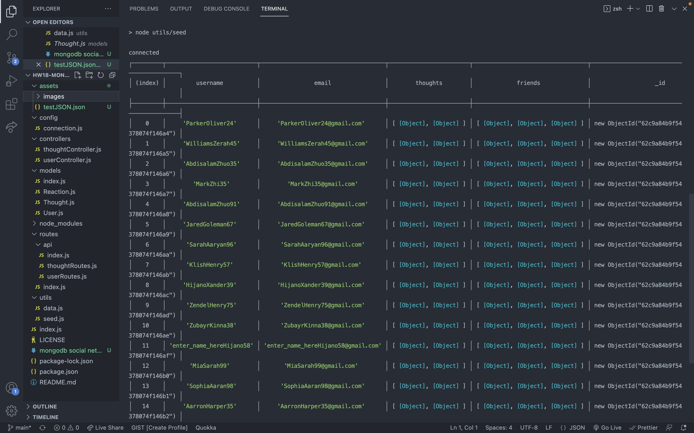
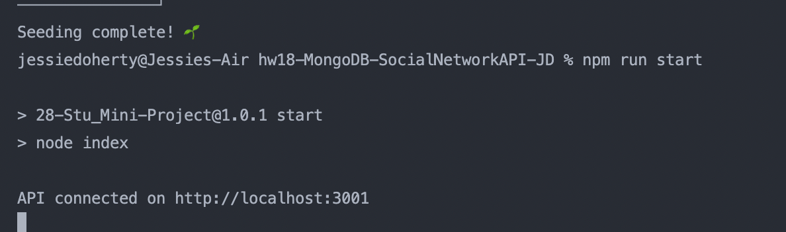

# MongoDB Social Network API

Designed by: Jessie Doherty

## Description

This MongoDB Social Network API is where users can share their thoughts, react to friends' thoughts, and create a friend list.

- What was your motivation?
- Answer: Social networking has been extremely popular lately, such as Twitter, Facebook, Instagram, etc. I would like to learn the basics of how to design and develop a social network api.

- Why did you build this project?
- Answer: Using Express.js routing, MongoDB database and Mongoose ODM, this app is a full-stack api that help users connect with friends by sharing or reacting to thoughts. Friendship could be closer!

- What problem does it solve?
- Answer: Making friends, sharing thoughts and react to thoughts; Create a friends list.

- What did you learn?
- Answer: Express.js, MongoDB database, Mongoose ODM.

## Installation

Please tell us the 3 simple steps for installing your app.

- Step 1: Use the Github link, open with VS code, run `npm install`.
- Step 2: Run `npm run seed`.
- Step 3: Run `npm run start`, then use Insomnia to test all the routes. I'll be sharing a video for this.

## Usage

- Install the API by following the 3 steps I mentioned above. Then, use Insomnia to test all the routes since this app is not deployed.
- Screenshots of the App

  - Terminal side:

    - 
    - 

  - Insomnia side:
    

## License

    MIT License

    Copyright (c) 2022 Jessie Doherty

    Permission is hereby granted, free of charge, to any person obtaining a copy
    of this software and associated documentation files (the "Software"), to deal
    in the Software without restriction, including without limitation the rights
    to use, copy, modify, merge, publish, distribute, sublicense, and/or sell
    copies of the Software, and to permit persons to whom the Software is
    furnished to do so, subject to the following conditions:

    The above copyright notice and this permission notice shall be included in all
    copies or substantial portions of the Software.

    THE SOFTWARE IS PROVIDED "AS IS", WITHOUT WARRANTY OF ANY KIND, EXPRESS OR
    IMPLIED, INCLUDING BUT NOT LIMITED TO THE WARRANTIES OF MERCHANTABILITY,
    FITNESS FOR A PARTICULAR PURPOSE AND NONINFRINGEMENT. IN NO EVENT SHALL THE
    AUTHORS OR COPYRIGHT HOLDERS BE LIABLE FOR ANY CLAIM, DAMAGES OR OTHER
    LIABILITY, WHETHER IN AN ACTION OF CONTRACT, TORT OR OTHERWISE, ARISING FROM,
    OUT OF OR IN CONNECTION WITH THE SOFTWARE OR THE USE OR OTHER DEALINGS IN THE
    SOFTWARE.

    ---

## 🏆 Miscellaneous

## Badges

- 
- 
- 
- 

## Features

- A social network API where users can share their thougths, react to friends' thoughts and create a friend list.

## How to Contribute

- This Github repo is open to all collaborators free of charge.

## Demo URL & Github Repo

- Demo Video:

  - [Seed & Run](https://drive.google.com/file/d/1bpOUiHz0cX--49IF1gmHofV8OR00jCik/view)
  - [User Routes](https://drive.google.com/file/d/169IWk-H3BQryGr7bKrENZcX5JsCy1yiA/view)
  - [Friends](https://drive.google.com/file/d/1PMw6HrfYfTd0uDhtfg4vlzsGgRSwDm-5/view)
  - [Thoughts](https://drive.google.com/file/d/1PMw6HrfYfTd0uDhtfg4vlzsGgRSwDm-5/view)
  - [Reactions](https://drive.google.com/file/d/1PMw6HrfYfTd0uDhtfg4vlzsGgRSwDm-5/view)

- Github Repo:
  [Github](https://github.com/zhuzhu930/hw18-MongoDB-SocialNetworkAPI-JD)
